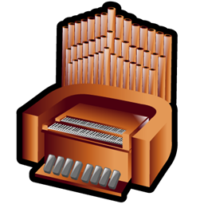

<!-- PROJECT LOGO -->
<br />
<div align="center">
  <a href="https://github.com/SgilPro/MCBach-Nuxt">
    
  </a>

  <h3 align="center">MC Bach</h3>

  <p align="center">
    An mind-blowing community for your joyful music and social experience!
    <br />
  </p>
</div>

## Tech Stack

[![Vue][vuejs-shield]][ref-vuejs]
[![Nuxt][nuxtjs-shield]][ref-nuxtjs]
[![Typescript][typescript-shield]][ref-typescript]

## Description

[Nest](https://github.com/nestjs/nest) framework TypeScript starter repository.

## Installation

```bash
$ npm install
```

## Running the app

```bash
# development
$ npm run dev

# production mode
$ npm run build && npm run preview
```

## Support

Nest is an MIT-licensed open source project. It can grow thanks to the sponsors and support by the amazing backers. If you'd like to join them, please [read more here](https://docs.nestjs.com/support).

## Stay in touch

- Author - [d9niel.code@gmail.com](mailto:d9niel.code@gmail.com)

## License

**MC Bach** is [MIT licensed](LICENSE).

<!-- BADGE LINKS -->

[ack-contributors-shield]: https://img.shields.io/github/contributors/andrechristikan/ack-nestjs-boilerplate?style=for-the-badge
[ack-forks-shield]: https://img.shields.io/github/forks/andrechristikan/ack-nestjs-boilerplate?style=for-the-badge
[ack-stars-shield]: https://img.shields.io/github/stars/andrechristikan/ack-nestjs-boilerplate?style=for-the-badge
[ack-issues-shield]: https://img.shields.io/github/issues/andrechristikan/ack-nestjs-boilerplate?style=for-the-badge
[ack-license-shield]: https://img.shields.io/github/license/andrechristikan/ack-nestjs-boilerplate?style=for-the-badge

[vuejs-shield]: https://img.shields.io/badge/Vue.js-4FC08D?logo=vuedotjs&logoColor=fff
[nuxtjs-shield]: https://img.shields.io/badge/Nuxt-002E3B?logo=nuxt&logoColor=#00DC82
[typescript-shield]: https://img.shields.io/badge/TypeScript-3178C6?logo=typescript&logoColor=fff
[vitest-shield]: https://img.shields.io/badge/Vitest-6E9F18?logo=vitest&logoColor=fff


<!-- Reference -->

[ref-vuejs]: https://vuejs.org
[ref-nuxtjs]: https://nuxt.com
[ref-typescript]: https://www.typescriptlang.org/
[ref-vitest]: https://vitest.dev/